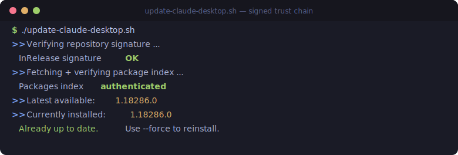

# Claude Desktop on Arch Linux

<p align="center">
  
  
  
  
  
  
</p>

> Install, update, and fully run Anthropic's **official** Claude Desktop — sign-in and Cowork's local VM included — on Arch Linux, verified against Anthropic's GPG signature.

<p align="center">
  
</p>

## TL;DR

```sh
git clone https://github.com/HxHippy/claude-desktop-arch
cd claude-desktop-arch
./update-claude-desktop.sh   # install — and re-run any time to update
./setup-cowork.sh            # only if you want Cowork's local VM
```

- Installs Anthropic's official `.deb` on Arch with no `apt`/`dpkg`.
- **GPG-verified and signature-chained** — never a bare checksum.
- Keeps the Chromium **sandbox on**; stores your sign-in in the **encrypted keyring**, not plaintext.
- Fixes Cowork by mapping Arch's QEMU/OVMF/virtiofsd paths to the ones the app expects.
- Verified on Arch x86_64 — read [what's tested vs. what isn't](#whats-tested-vs-what-isnt) before running.

## Contents

- [Why this exists](#why-this-exists)
- [What's here](#whats-here)
- [Install](#install)
- [How the install works](#how-the-install-works)
- [The keyring fix](#the-keyring-fix)
- [Cowork (local VM)](#cowork-local-vm)
- [What's tested vs. what isn't](#whats-tested-vs-what-isnt)
- [Requirements](#requirements)
- [Uninstall](#uninstall)
- [Disclaimer](#disclaimer)
- [License](#license)

## Why this exists

Anthropic ships [Claude Desktop for Linux](https://code.claude.com/docs) as a Debian/Ubuntu `.deb` behind an apt repository. Arch has no `apt` or `dpkg`, so the documented install does nothing here.

This repo installs the **official** package anyway — verified against Anthropic's GPG signature, not just a checksum — and fixes the two things that break on a non-Debian, non-GNOME/KDE system: **keyring-backed sign-in** and **Cowork's local VM**.

Nothing here weakens the app's security model. The Chromium sandbox stays on, sign-in tokens go to your encrypted keyring instead of plaintext, and Cowork still runs inside a real QEMU/KVM virtual machine.

## What's here

| Script | Does |
|---|---|
| `update-claude-desktop.sh` | Installs **and** updates Claude Desktop from Anthropic's signed apt repo, with a full GPG trust chain. Re-run any time to upgrade. |
| `setup-cowork.sh` | Makes the Cowork feature's QEMU/KVM VM work on Arch by mapping Arch's firmware/virtiofsd paths to the Debian paths the app expects. |

## Install

```sh
git clone https://github.com/HxHippy/claude-desktop-arch
cd claude-desktop-arch
./update-claude-desktop.sh
```

Then launch from your app menu or run `claude-desktop`, and sign in.

To update later, just run it again — it no-ops if you're already on the latest build:

```sh
./update-claude-desktop.sh          # upgrade if a newer version exists
./update-claude-desktop.sh --force  # reinstall the current version
```

A handy alias:

```sh
alias claude-update='~/path/to/claude-desktop-arch/update-claude-desktop.sh'
```

## How the install works

A `.deb` is an `ar` archive wrapping a tarball. The script:

1. **Verifies authenticity with GPG, not just SHA256.** It carries Anthropic's release signing key (fingerprint `31DD DE24 DDFA B679 F42D 7BD2 BAA9 29FF 1A7E CACE`, pinned in the script), uses it to verify the repo's signed `InRelease`, reads the `Packages` index hash from that *signed* file, then chains the `.deb`'s SHA256 off it. A tampered mirror, MITM, or swapped key is rejected before anything touches your system. SHA256-alone is never trusted.
2. **Installs to `/opt/claude-desktop`**, root-owned.
3. **Restores setuid-root on `chrome-sandbox`** — last, after `chown` (which strips it). This keeps the Chromium sandbox working without the insecure `--no-sandbox` flag. On kernels that allow unprivileged user namespaces (Arch's default) the namespace sandbox also works; the setuid helper is what covers hardened kernels too.
4. **Installs a launcher wrapper** at `/usr/local/bin/claude-desktop` (see below).

## The keyring fix

On a fresh sign-in you may see *"Your sign-in won't be saved on this device."* The keyring is usually fine — the real cause is Chromium's password-store auto-detection, which only maps **GNOME → libsecret** and **KDE → KWallet**. Every other desktop (Hyprland, sway, COSMIC, …) resolves to "other" and falls back to the **basic plaintext** store, which the app reports as a missing keyring.

The launcher wrapper forces the right backend:

```sh
exec /opt/claude-desktop/claude-desktop --password-store=gnome-libsecret "$@"
```

For this to actually protect your token, your default keyring must have a real password (ideally your login password, so PAM unlocks it at login). A keyring with an empty password is effectively plaintext at rest.

## Cowork (local VM)

Cowork runs agent work inside a local QEMU/KVM VM. If you see *"Virtualization isn't fully set up"*, run:

```sh
./setup-cowork.sh
```

It installs `qemu-system-x86`, `edk2-ovmf`, and `virtiofsd` if missing, then symlinks Arch's files to the Debian paths the app probes:

| App expects | Arch ships | Bridge |
|---|---|---|
| `/usr/share/OVMF/OVMF_CODE_4M.fd` | `/usr/share/edk2/x64/OVMF_CODE.4m.fd` | symlink |
| `/usr/share/OVMF/OVMF_VARS_4M.fd` | `/usr/share/edk2/x64/OVMF_VARS.4m.fd` | symlink |
| `/usr/libexec/virtiofsd` | `/usr/lib/virtiofsd` | symlink |
| `qemu-system-x86_64` on PATH | `/usr/bin/qemu-system-x86_64` | already correct |

KVM acceleration needs `/dev/kvm` access — the script checks it and tells you to join the `kvm` group if you haven't. The symlinks point at Arch package files, so they survive Claude Desktop upgrades.

## What's tested vs. what isn't

Be honest about this before you run it on your machine.

**Tested and verified** (on Arch, x86_64, Hyprland, kernel 6.x/7.x):

- Full install and update path end to end via `update-claude-desktop.sh --force`: signature verify → index verify → download → `.deb` hash verify → extract → install. Resulting install checked: `chrome-sandbox` is setuid-root, the launcher wrapper is correct, the version stamp, desktop entry, and icons are all in place.
- The GPG gate actually rejects tampering: a signed `InRelease` with a single flipped byte is refused; the clean one is accepted. Verification is not a no-op.
- The input sanitiser rejects shell-injection attempts in the version string (`"; rm -rf /`, `$(...)`, `&& …`) while accepting real version formats.
- `setup-cowork.sh` on Arch: package detection, path discovery, symlink creation, and the KVM readiness checks. Cowork's prerequisites are satisfied after running it.

**Not tested / verify for yourself:**

- **arm64.** The `aarch64` code path (firmware names, `qemu-efi-aarch64`) is by inspection only. It has not been run on real arm64 hardware.
- **Non-Arch distros.** `update-claude-desktop.sh` is written to be distro-agnostic, but only Arch has been exercised. `setup-cowork.sh` is Arch-specific (it uses `pacman`).
- **Desktops other than Hyprland.** The keyring fix is correct in principle for any non-GNOME/KDE session (sway, COSMIC, …), but only Hyprland was tested live.
- **A real Cowork VM boot to a working session.** The host prerequisites are verified; a full guest boot depends on your signed-in account and hardware.
- **Install atomicity.** The installer does `rm -rf /opt/claude-desktop` before copying the new files. If it dies mid-install (disk full, killed process), the previous install is already gone — re-run to recover. It is not a rollback-safe atomic swap.

## Requirements

- Arch Linux (or a pacman-based derivative), x86_64 or arm64
- A desktop session with a Secret Service provider (`gnome-keyring`) for sign-in persistence
- For Cowork: hardware virtualization (VT-x/AMD-V) and `/dev/kvm` access

## Uninstall

```sh
sudo rm -rf /opt/claude-desktop
sudo rm -f  /usr/local/bin/claude-desktop
sudo rm -f  /usr/local/share/applications/claude-desktop.desktop
sudo rm -f  /usr/local/share/icons/hicolor/*/apps/claude-desktop.png
# Cowork bridges (optional):
sudo rm -f  /usr/share/OVMF/OVMF_CODE_4M.fd /usr/share/OVMF/OVMF_VARS_4M.fd /usr/libexec/virtiofsd
```

## Disclaimer

Unofficial. Not affiliated with or endorsed by Anthropic. It installs Anthropic's official, signed binaries by hand on a platform they don't officially support yet. "Claude" is a trademark of Anthropic.

## License

MIT — see [LICENSE](LICENSE).
